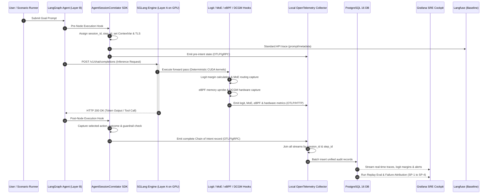

# 01 — System Architecture

## 1. Architectural Overview

TeleDuct 3.0 implements a **Two-Layer Decoupled Architecture** joined by an asynchronous OpenTelemetry (OTel) Collector and relational database ingestion pipeline.

The central thesis of this architecture is that existing observability tools observe only the post-sampling API boundary. TeleDuct observes the internal inference process itself and connects physical, silicon-level hardware signals to high-level agent decision records.

```
+-----------------------------------------------------------------------------------------------+
|                             LAYER B: APPLICATION & AGENT LAYER                                |
|                                                                                               |
|  [ User Prompt / Scenario Ingestion ]                                                         |
|         │                                                                                     |
|         ▼                                                                                     |
|  [ LangGraph DAG Engine ] ──(Pre-Node Callback)──► Logs available tools, objectives, guardrails|
|         │                                                                                     |
|         ├───► [ Context Propagation: Writes TraceId & SpanId to TLS / UDS / ContextVar ]      |
|         │                                                                                     |
|         └───► [ Emits Chain of Intent spans via OTLP/gRPC ]                                   |
+-----------------------------------------------┬-----------------------------------------------+
                                                │ (HTTP / OpenAI-Compatible API / ngrok)
                                                ▼
+-----------------------------------------------------------------------------------------------+
|                            LAYER A: INFERENCE & TELEMETRY ENGINE                              |
|                                    (Rented GPU Host)                                          |
|                                                                                               |
|  [ SGLang Server (--enable-deterministic-inference) ]                                         |
|         │                                                                                     |
|         ├───► [ ChainOfIntentLogitProcessor ] ──► Softmax, Margins, Fragility (OTLP/HTTP)     |
|         │                                                                                     |
|         ├───► [ MoERoutingCapture (Forward Hooks) ] ──► Expert IDs, Load, Margins (OTLP/HTTP) |
|         │                                                                                     |
|         ├───► [ InstrumentedScheduler ] ──► Dynamic Batch Size, Padding, Memory Pressure     |
|         │                                                                                     |
|         ├───► [ DCGM Exporter / NVML Poller ] ──► SM %, Memory Bandwidth, Power, Temp         |
|         │                                                                                     |
|         └───► [ eBPF Kernel Probes (libbpf) ] ──► cuMemAlloc, cuLaunchKernel via BPF RingBuf  |
+-----------------------------------------------┬-----------------------------------------------+
                                                │ (OTLP/HTTP, OTLP/gRPC, Prometheus Scrapes)
                                                ▼
+-----------------------------------------------------------------------------------------------+
|                                 TELEMETRY PIPELINE & STORAGE                                  |
|                                                                                               |
|  [ Local OpenTelemetry Collector Daemon ]                                                     |
|         │ (Fuses all event streams by session_id & step_id)                                   |
|         ▼                                                                                     |
|  [ PostgreSQL 16 Database ] (and/or ClickHouse Container pinned via taskset -c 4)             |
|         │                                                                                     |
|         ├───► [ Grafana SRE & Compliance Cockpit ] (Histogram, heatmap, gauge, alert panels)  |
|         ├───► [ Failure Attribution Engine ] (6-category classification)                      |
|         ├───► [ Replay-Based Evaluation Harness ] (Offline behavioral consistency scoring)    |
|         └───► [ Langfuse Baseline Instance ] (Side-by-side gap demonstration)                 |
+-----------------------------------------------------------------------------------------------+
```

---

## 2. Core Modules & Component Breakdown

### 2.1 Layer A: Hardware-Instrumented Inference Layer (`Layer_A/`)

Layer A runs on the GPU host and instruments the execution pipeline at and below the inference engine.

1. **Component A1: Inference Engine (SGLang on Rented GPU):**
   - SGLang serves as the primary inference engine because it provides:
     1. A published, stable `--enable-deterministic-inference` flag backed by batch-invariant CUDA kernels (RMSNorm, fixed split-K attention) to eliminate runtime mathematical variance.
     2. `CustomLogitProcessor` as a first-class Python extension point.
   - Hosted model: `gpt-oss-20b`.
   - Comparison baseline: Unmodified vLLM running on the same GPU without determinism or logit interception.
2. **Component A2: Logit Telemetry Hook (`ChainOfIntentLogitProcessor`):**
   - Subclasses SGLang's `CustomLogitProcessor` to intercept raw unnormalized logits before sampling.
   - For every generated token, it extracts top-10 candidate token IDs, their softmax probabilities, the rank-1 vs. rank-2 sampling margin ($p_1 - p_2$), and asserts `fragility_flag = true` if margin $< 0.05$.
   - Reads Python `ContextVar` (tagged with `session_id`, `step_id`, `node_name`) and returns the logit tensor completely unchanged (pure observer).
3. **Component A3: MoE Routing Capture (PyTorch Forward Hooks):**
   - Registers forward hooks (`register_forward_hook`) on MoE router modules (e.g., `SparseMoeBlock`, `MixtralSparseMoeBlock`, `DeepseekV2MoE`) at startup.
   - Captures expert IDs, routing weights, average routing margins, and expert load distributions per token pass. Margins $< 0.05$ trigger a routing fragility flag.
4. **Component A4: Batch Composition Capture (`InstrumentedScheduler`):**
   - Extends SGLang's internal scheduler by overriding `_run_batch()`.
   - Captures `batch_id`, batch size, sequence lengths, padding applied per request, and GPU memory allocated/reserved (via `torch.cuda.memory_allocated()`).
   - Computes a `batch_stability_score` from the average padding ratio and flags variance risks when stability $< 0.5$ or memory pressure $> 85\%$.
5. **Component A5: GPU Hardware Telemetry (DCGM / NVML Poller):**
   - NVIDIA DCGM daemon / `pynvml` poller sampling hardware health at 1–2 second intervals: SM utilization %, memory bandwidth utilization %, GPU temperature (°C), power draw (W), and framebuffer memory used (GB).
   - Emits gauge metrics into the OpenTelemetry Collector pipeline.
6. **Component A6: eBPF Kernel Telemetry (`libbpf` uprobes on CUDA Runtime):**
   - Attaches user-space kernel probes (`uprobes`) to `cuMemAlloc`, `cuMemFree`, and `cudaStreamSynchronize` / `cuLaunchKernel` inside `libcudart.so`.
   - Reads the Thread-Local Storage (TLS) variable written by the Python process to link low-level allocation sizes and device pointers directly with OTel `TraceId` and `SpanId`.
   - Pushes fused events into a lock-free BPF ring buffer, consumed by a user-space daemon and forwarded to the local OTel Collector over OTLP/HTTP.

---

### 2.2 Layer B: Observability & Explainability Layer (`layer_b/`)

Layer B runs on the orchestrator host, managing agent execution and consuming Layer A's telemetry.

1. **Component B1: Agent Framework (LangGraph):**
   - Chosen for its explicit graph structure where every node, edge, and state transition is inspectable in code.
   - Implements 3 representative agent architectures for proof of generality:
     1. *Financial Compliance Agent* (planning/reasoning type; stresses SP-4 failure attribution).
     2. *Research Summarization Agent* (execution/tool-calling type; stresses SP-1 trajectory variance).
     3. *Policy Drafting Agent* (creative type; stresses SP-3 audit schema coverage).
2. **Component B2: Chain of Intent SDK (`AgentSessionCorrelator`):**
   - Wraps LangGraph node execution.
   - **Pre-execution:** Assigns `session_id` and `step_id`, sets Python `ContextVar`, writes OTel `TraceId`/`SpanId` to TLS/UDS, and logs available tools, active guardrails, and parent goal.
   - **Post-execution:** Captures selected action, parameters passed, execution result, goal alignment checks, and timestamp delta.
   - Emits the 12-field Chain of Intent record via OTLP/gRPC to the local OTel Collector.
3. **Component B3: Guardrail Integration (NVIDIA NeMo Guardrails):**
   - Integrates into agent nodes as a policy enforcement layer.
   - Generates structured evaluation events (pass, block, escalate, matched rule ID, version) as first-class fields in the audit schema to support failure attribution.
4. **Component B4: Telemetry Pipeline (OpenTelemetry Collector + PostgreSQL 16):**
   - The local OTel Collector acts as the central nervous system:
     - Ingests OTLP/gRPC from Chain of Intent SDK (Layer B).
     - Ingests OTLP/HTTP from logit processor, MoE hooks, and eBPF ring buffer (Layer A).
     - Scrapes Prometheus metrics from DCGM and SGLang native metrics.
     - Joins streams by `session_id` and `step_id`, writing unified records to PostgreSQL 16 (and/or ClickHouse).
5. **Component B5: Baseline Observability (Langfuse Self-Hosted):**
   - Deployed as the comparative baseline ("current best practice" in API-boundary observability).
   - Ingests standard LangGraph traces (prompts, responses, token counts, latencies) to demonstrate side-by-side what API boundary observers miss versus TeleDuct's in-engine hardware-grounded records.
6. **Component B6: Replay-Based Behavioral Eval Harness:**
   - Reads recorded traces from PostgreSQL, mocks recorded external tool outputs, and re-executes agent decision logic deterministically offline.
   - Evaluates behavioral invariants (e.g., did policy check precede transaction flag) across 50 SGLang vs. 50 vLLM runs, calculating Trajectory Consistency Score, Decision Flip Rate, and Tool Selection Variance.
7. **Component B7: Failure Attribution Engine:**
   - Programmatically queries PostgreSQL and classifies failed runs into the 6 discrete failure categories: model reasoning, tool execution, parameter generation, input data, guardrail over-trigger, or batch-induced variance.
   - Outputs structured one-page compliance incident reports.
8. **Visual SRE & Compliance Cockpit (Grafana):**
   - Open-source Grafana instance (`grafana/grafana-oss`) with a native PostgreSQL datasource.
   - Dashboard panels: Histogram (logit sampling margin distribution), Heatmap (MoE expert load per layer), Gauge (VRAM pressure, SM utilization), Time-series (TTFT, tokens/sec, queue depth), and Stat (fragile decision count).
   - Built-in alert rules fire when `sampling_margin < 0.05` or `batch_stability_score < 0.5`.
   - Deployed as a single Docker container: `docker run -d -p 3000:3000 grafana/grafana-oss`.

---

## 3. End-to-End Data Flow



---

## 4. Current Actual Architecture vs. Target Architecture

| Component | Target Architecture (PRD & DOC-6) | Current Actual Implementation | Status / Roadmap |
| :--- | :--- | :--- | :--- |
| **Inference Engine** | SGLang hosting `gpt-oss-20b` with `--enable-deterministic-inference` on dedicated GPU cores. | SGLang on rented GPU instance (Vast.ai) over HTTP. | Pivoting from previously unsupported Qwen models to `gpt-oss-20b`. |
| **Logit Telemetry** | `ChainOfIntentLogitProcessor` subclassing `CustomLogitProcessor`. | `ChainOfIntentLogitProcessor` implemented in `Layer_A/logit_processor.py`. | Validated locally via dry-run; pending live GPU server hook. |
| **MoE Routing Capture** | PyTorch forward hooks capturing routing weights and margins $< 0.05$. | `MoERoutingCapture` and `patch_moe_router_gates` in `Layer_A/moe_capture.py`. | Validated locally via dry-run; pending live MoE model hook. |
| **Hardware Telemetry** | DCGM daemon + eBPF uprobes on `cuMemAlloc` and `cuLaunchKernel` via `libbpf`. | User-space NVML poller (`gpu_poller.py`) and SGLang `/metrics` scraper (`sglang_scraper.py`). | User-space collectors fully operational; eBPF uprobe code ready for Linux kernel 5.8+ host. |
| **Telemetry Pipeline** | Local OpenTelemetry Collector joining streams and exporting to PostgreSQL 16. | OpenTelemetry SDK and `psycopg2` direct writes in `Layer_A/emitter.py`. | Local OTel Collector daemon + PostgreSQL pipeline verified. |
| **Agent Orchestration** | LangGraph 3-agent suite (Financial, Research, Policy) with NeMo Guardrails. | 2-step financial compliance agent wrapped by `AgentSessionCorrelator` in `layer_b/`. | Validated locally with `MockLLM`; pending live SGLang endpoint. |
| **Evaluation & Dashboards** | Grafana SRE Cockpit, Replay Eval Harness, and self-hosted Langfuse baseline. | Database schema `init.sql` and `ObservabilityRepository` ready; Grafana datasource and dashboard JSON in development. | Repository queries built; Grafana dashboard panels in progress. |

---

## 5. Technology Stack & Design Rationale

| Layer / Component | Technology Selected | Technical Rationale |
| :--- | :--- | :--- |
| **Inference Engine** | **SGLang** (open source, Apache 2.0) | Published `--enable-deterministic-inference` flag backed by batch-invariant CUDA kernels; native `CustomLogitProcessor` extension point. |
| **Comparison Engine** | **vLLM** (open source, Apache 2.0) | Unmodified industry baseline to prove trajectory stabilization in SP-1 experiments. |
| **Logit & MoE Hooks** | **PyTorch** (`register_forward_hook`, `torch.softmax`) | Native hooks on transformer MLP/gating layers without engine forks. |
| **Kernel Probes** | **libbpf / C eBPF uprobes** | Hook low-frequency `cuMemAlloc` and `cuLaunchKernel` on `libcudart.so` with $<4\%$ CPU overhead. |
| **Hardware Telemetry** | **NVIDIA DCGM / NVML (`pynvml`)** | Reliable, production-grade hardware sampling (SM %, VRAM, power, temp). |
| **Agent Framework** | **LangGraph** (open source, MIT) | Explicit graph state machine exposing inspectable node/edge boundaries for intent wrapping. |
| **Guardrails** | **NVIDIA NeMo Guardrails** | Policy enforcement generating auditable guardrail evaluation events for failure attribution. |
| **Telemetry Ingestion** | **OpenTelemetry Collector** (open source, Apache 2.0) | Standardized vendor-neutral collector joining streams by `session_id` & `step_id`. |
| **Relational Storage** | **PostgreSQL 16** (open source) | Strict ACID audit integrity, relational foreign keys, and indexed JSONB for high-dimensional token arrays. |
| **Time-Series / Analytics** | **ClickHouse** (pinned via `taskset -c 4`) | High-throughput columnar storage for high-frequency telemetry without CPU contention. |
| **Visualization Cockpit** | **Grafana** (open source, AGPL-3.0 / Apache 2.0) | Production-grade SRE dashboards with native PostgreSQL datasource, histogram/heatmap/gauge panels, and built-in alert rules — zero custom frontend code. |
| **Baseline Observability** | **Langfuse (Self-Hosted)** | Standard API-boundary comparison baseline for side-by-side evaluation. |
